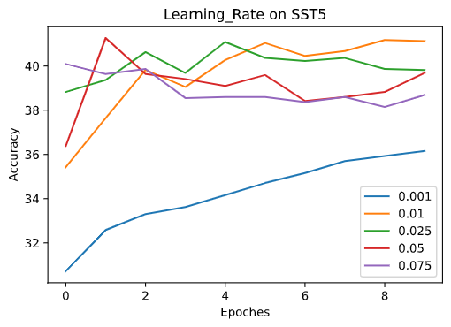
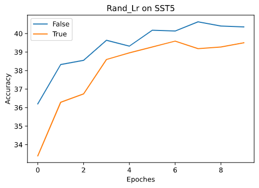
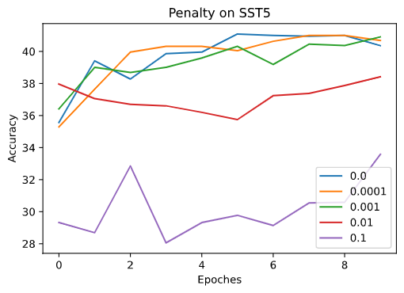
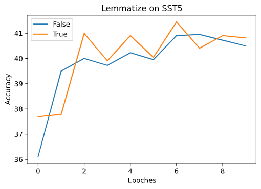
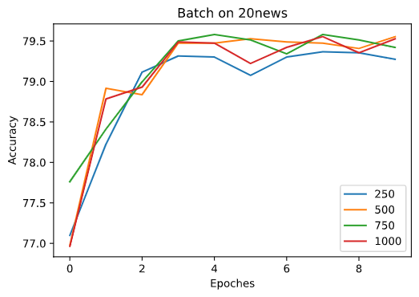
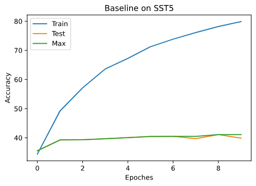
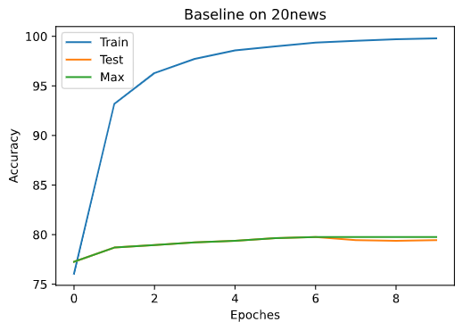

# EMNLP A1 Report: Self-implemented Log-linear Model for Text Classification

## Requirements, Dependencies and Code References

The model is implemented in Python, version **3.8.x**. Four third-party packages are used: 

- `pandas` for organizing data,
- `numpy` for linear algebra calculations,
- `rich` for terminal pretty printing,
- `click` for building CLI.

**No other extra toolkits or model implementations are used**. Detailed version information can be found in `requirements.txt`. For hardware, a regular PC with 8GB RAM should be sufficient for at least baseline cases.

Some optimizations *are inspired* by [Sishuo Chen's implementation](https://github.com/PKUCSS/LogLinearTextClassification), but it is guaranteed that **the majority of the code, especially the model part is completely written by myself**, as you can verify that the data structures, feature extraction processes and even gradient descent methods are quite different. Comparisons between Chen's implementation and mine are included in this report.

## Brief on Results

My implementation extract **unigrams and bigrams** for features, and use **stochastic gradient descent** as updating algorithm. On SST5 set, the typical accuracy is around **35%-40%**, while the highest record is *41.58%*. On 20news set, the typical accuracy is around **75%-79%**, while the highest record is *81.30%*.

## File Structures

<span style="color:red;font-weight:bold">Please put training and testing data into the `data` folder as follows, and the name is CASE SENSITIVE!:</span> 

- `data/SST5/train.csv` and `data/SST5/test.csv` for SST5. **Please be aware of renaming**.
- `data/20news/train.csv` and `data/20news/train.csv` for Newsgroup20

``` 
/
|- data/       -> Where dataset should be stored
|  |- SST5/
|  |- 20news/
|
|- corpora/    -> External data used in preprocessing
|- records/    -> Store of human readable accuracy results
|- presets/    -> Store reproducible training results
|- evaluation/ -> Data and picture used in this report
|
|- main.py       => Entrance, CLI functions
|- model.py      => The logics of the model
|- preprocess.py => Data cleaning and feature extraction
|- calc.py       => Feature vector generation, probability calculation and descent algorithm
|- hyper.py      => Hyper parameters class
|- terminal.py   => Terminal pretty printing
|- run.sh
```

Launching `run.sh` or `python main.py` will start the tour. The tour includes baseline for both sets, ablation on SST5 for learning rate, and a preset on 20news. Each part will only proceed after confirmation.

## Model Implementation and Gradient Descent Algorithm

First of all, features are extracted from the training set, forming a vector $f$. During an epoch, the training set is cut into several batches. For every piece of document text $x_i$ in the batch, an indicator vector $f_i$ is calculated with following pattern:
$$
\chi_j(x_i) = \left\{
\begin{aligned}
&1 & x_i \text{ contains } \mathrm{feature}_j \\
&0 & \mathrm{otherwise}
\end{aligned}
\right.
,\ j = 1,2, \dots \\
f_i = (\chi_1, \chi_2, \dots)
$$
The iteration comes after this procedure. During each iteration, two steps are performed on every piece of sample before moving on to the next one, which is probability calculation and gradient descent. 

To calculate probability, get a weighted score vector $s_{i} = (s_{i,1}, \dots,s_{i, k})$ for each $x_i$ with each proposed tag $y_k$, according to weights matrix $w$, which consists of two dimensions, tag and feature, thus $w_{k,j}$ stands for the weight of using feature $\chi_j$ as a hint for label $y_k$ . (The second equation resembles the equivalent linear algebra calculation implementation, and the same pattern applies for the following equation blocks):
$$
\begin{align}
s_{i,k;w} & = \sum_{j}w_{k,j}\chi_j(x_i) \\
s_{i;w} &= f_i\cdot w^T \\
\end{align}
$$

Then, get the probability of labelling $x_i$ with $y_k$ according to the probabilistic model:
$$
\begin{align}
P(y_k|x_i;w)=p_{i,k} &= \frac{\exp(s_{i,k;w})}{\sum_{k'}\exp(s_{i,k';w})} \\
p_{i;w} &= \frac{\exp(s_{i;w})}{\sum\exp(s_{i;w})}
\end{align}
$$

For maximizing the following log-likelihood (where $y(i)$ stands for the index of the actual label of $x_i$):
$$
LL(\hat{w}) = \sum_{i} f_i \cdot {\hat{w}_{y(i)}}^T - \sum_{i} \log \sum_{k'} \exp(f_i \cdot {\hat{w}_k}^T)
$$

Calculate its gradient $\nabla LL(\hat{w})$, where:
$$
\frac{\partial LL(\hat{w})}{\partial \hat{w}_{k,j}} = \sum_{i'}I_i(k) f_{i,j} - \sum_{i'}\sum_{k'} p_{i,k';\hat{w}}f_{i,j}
$$
among which $I_i(k)$ is a indicator function for verifying whether the label $y_k$ is the actual label $y_{y(i)}$.
$$
I_i(k) = \left\{
\begin{aligned}
&1 & y(i) = k \\
&0 & \mathrm{otherwise}
\end{aligned}
\right.
$$

The first item is the empirical weight, while the second is the expected one under current $\hat{w}$. The differences among three gradient descent algorithms lie in the sum over $i'$ when calculating the gradient. The batch gradient descent iterates over the full training set ($\sum_{i'}^{|x|}$) before descending once, while stochastic gradient descent algorithm does not iterate ($\sum_{i'=i_0}^{i_0}$), it descends right after the probability calculation of every single sample. The intermediate method is to iterate over a single batch $\sum_{i'}^{b}$ before descending, that's mini-batch gradient descent. My model implements **stochastic gradient descent**. It converges faster than the batch method at the price of more violent oscillation around the best solution.

Optionally, a **penalty** can be substracted from the gradient for preventing overfitting ($\alpha$ is a predefined hyper parameter):
$$
\alpha\hat{w}_{k,j}
$$
The descent is performed on the weights matrix over following procedure:
$$
\hat{w} := \hat{w}+\beta \nabla LL(\hat{w})
$$
where $\beta$ is learning rate, a hyper parameter. It is feasible to yield multiple $\beta$ randomly and pick the one maximizes log-likelihood, but the computation cost is way too high. The current version of model provides two ways of deciding learning rate, **assigning a fixed value**, or **generating a random value** during each descent.

Because of the use of matrix calculation, this step is the performance bottleneck of the model.

After descent, move on to the next sample and repeat the process until reaching the end of the batch. Whether to iterate over the same batch repeatedly can be tuned by the hyper parameter of `iteration`, instead of hardcoding to iterate until converge.

When an epoch is completed, predictions of training and testing sets are made simply according to the probability:
$$
\hat{y}(i) = \arg\max_k p_{i,k}
$$
Finally, shuffle the order of samples before entering the next epoch.

## Performance

Compare to Chen's implementation, vector and matrix calculations are used to simplify the code, but as the feature vector or batch size grows, these calculations are overwhelmingly outperformed by native Python operations. It also increased the risk of memory overflowing. Typically it takes **1 minute** for an epoch on 20news dataset and **5 seconds** for SST5 dataset. Clearly the performance gap is wider on larger datasets. 

## Data Cleaning

The data cleaning process consists of the sole step, **tokenization**(`preprocess.segmentate`). Referencing Chen's implementation, the tokenization is based on [code](https://github.com/yoonkim/CNN_sentence/blob/master/process_data.py), while rules originally created in my previous self-implementation for cleaning Markdown Syntax and email are added(The original self-implementation is dropped due to over cleaning, too many words are wiped out; switching tokenization function improved the performance on 20news dataset by 5%). 

**Lemmatization** inspired by Chen's implementation seems to increase the performance of my model. Theoretically lemmatization will reduce the 'grammatical' noise in the dataset, as our model yields predictions relevant to semantics. However, skipping lemmatization significantly increases the accuracy of Chen's implementation by 2%. In his implementation, the lemmatization takes place during feature extraction, which may cause document texts failing feature indicator functions. It should be done during data cleaning. 

## Feature Extraction

The implementation utilizes **unigrams and bigrams** for features, and trigrams can be included optionally. Internally the bigrams and trigrams are stored as the string form of a tuple. For a senctence like `[empirical, natural, language, processing]`(quotes are dropped), the unigrams and bigrams generated are `empirical, natural, language, processing, (empirical, natural), (natural, language), (language, processing)`. 

Note that the **stopwords** are expelled during feature extraction, not data cleaning. Removing stopwords during data cleaning might cause two separate words being pulled together unexpectedly. For example, sentences like `[He, is, unhappy, I, am, happy`, if the stopwords `[I, am]` are dropped before feature generation, it might generate feature `(unhappy, happy)`, which would never appear in any English texts. Instead, unigrams and bigrams(created by cartesian product) are generated from the stopwords list, forming a new set $St$, and the final feature set comes from the difference set: $F := F \setminus St$, as stopwords in bigrams are sometimes informational, such as `not` in `(not, happy)`. It is those bigrams that only contain stopwords should be removed, like `(I, am)`.

After the features are extracted, they are categorized according to the actual label of its souce text. There is an optional hyper parameter to drop a certain ratio of features for each label, which could leach out some of the useless features by chance, but it's not stable and is mostly used during debugging. 

Then the features are joint together, and **their frequency in the whole training set** is evaluated, and a fixed amount of features with highest frequencies will be picked. This process is inspired by Chen's implementation. Although these features might not resemble a certain label the best, but choosing them would help to **reduce the sparsity** of the feature vector. The size of the finalized features can be set through hyper parameter, and there is another option to sample according to absolute frequency(`--feature_pick 'freq'`) instead of picking the top ones(but it performs disastrously). Most of the feature ngrams won't show up in a lot of sample texts, so the absolute frequencies will fall into a small range, thus it's wiser to just pick the top. The same applies to feature set size. It is reasonable to appraise that most of the features won't be seen in the whole testing set, so increasing the feature set size will only hurt performance without much boost on effectiveness.

The above conclusion on feature picking might sound confusing, as the information theory tells us the *information quantity is negatively correlated to frequencies*, so intuitively IDF algorithms(Term Frequency–Inverse Document Frequency) seems to fit better. However, the word that contains most information doesn't necessarily be the best sign for a certain label, as it might introduced information irrelevant to the labelling task(kinds of like overfitting). The goal is to find the common ground, not the unique feature. A more idealic implementation should evaluate the frequencies within texts of a certain label, rather than the whole set.

Internally for generating feature vectors for each sample text, a hashmap is generated from the feature set, giving each feature a unique ID $j$. To verify whether the sample text $x_i$ contains certain feature, iterate over its ngrams and check if they are present in the hashmap. Then the $j$th item in the feature vector $f_i$ will be set 1.

## Evaluation and Hyper Parameter Tuning

The default hyper parameters are as follows(the orange one is the shorthand for CLI):

```json
{
    "dataset": "SST5",        // -d '20news'|'SST5'. Dataset used
    "trigram": false,         // Generate trigrams
    "stopword": true,         // Remove stopwords in feature
    "lemmatize": true,        // Lemmatize during data cleaning
    "rand_lr": false,         // -r Random learning rate
    "feature_pick": "top",    // 'top'|'freq'. Feature picking method
    "feature_drop": 0.0,      // Drop fraction of features before picking
    "feature_size": 20000,    // -f Feature vector size
    "penalty": 0.0,           // Regularization penalty
    "lr_fixed": 0.01,         // -l Fixed learning rate
    "lr_rand_coef": 0.01,     // -l Coefficient applied to random learning rate
    "iteration": 1,           // -i Iteration count
    "batch": 500,             // -b Batch size
    "epoch": 10,              // -e Epoch count
}    
```

The CLI command `ablation` can be used for ablation testing.

Higher learning rate will certainly accelerate the converging process, and the risk of overfitting will soar. Random learning rate can be useful during debugging when the fixed value cannot be decided, but it is outperformed by fixed ones in most of the cases. So fixed value 0.01 is chosen as baseline. In the meantime, it's not worthy to tune up learning rate for getting a higher accuracy as quickly as possible, because higher learning rate means oscillation is more violent, and the model will not yield stable results.





The optimization brought by naive penalty for regularization seems to be subtle, so there is no regularization in baseline case. On SST5 set, the weights don't fit training set well, let alone overfitting. The effectiveness plateau of SST5 should be caused by feature extraction(Ngrams cannot show emotions well).



Lemmatization improves the performance, as mentioned above.



For batch size, there is **no significant difference** attested on 20news, but larger batches seems to work better slightly. With stochastic gradient descent algorithm, the weights are adjusted after evaluating each sample, regardless of the batch size. The batches are only introduced to decrease the memory used in feature vector calculation processes and prevent Pandas DataFrames and Numpy arrays from overflowing. So the batch size won't affect results as Chen's evaluation, as he is using **mini-batch gradient descent** algorithm. Ideally, the mini-batch algorithm **should work better**, as it *strikes a balance between performance and updating speed*. However, it is attested that this matrices based implementation will certainly suffer from memory and calculation bottlenecks during iteration over the batch, so there is no option besides stochastic method.



The results of baseline cases are as follows. It is clearly seen that the 20news case starts to overfit after epoch 6, while the SST5 case seems to oscillate. So, for reaching better performance, an extra iteration is introduced to SST5 to accelerate its converging process, while increasing feature size and batch size for an extra bit of boost, reaching the record high results. These records are shown in the appendix.





## Brief Conclusions

- Self implemented models still have performance issues on some tasks. Toolkits written in C might help.
- Ngram features are not enough for SST5 task.
- The bottleneck of this model lies mainly on **feature picking** and **regularization**.

## Appendix

### CLI

```shell
$ python main.py --help
Usage: main.py [OPTIONS] COMMAND [ARGS]...

Options:
  --help  Show this message and exit.

Commands:
  ablation
  preset
  tour
  train
```

```shell
$ python main.py train --help   
Usage: main.py train [OPTIONS]

Options:
  -n, --name TEXT               A name assigned for improving readability.
  -o, --output TEXT             Output results to [filename].md under records/
  -j, --export TEXT             Export model to [filename].json under presets/
  -d, --dataset TEXT            Dataset used.
  -e, --epoch INTEGER
  -b, --batch INTEGER
  -i, --iteration INTEGER
  -f, --feature_size INTEGER
  -r, --rand_lr / --no-rand_lr  Use random learning rate
  -l, --lr FLOAT                Learning rate or coefficient of random
                                learning rate.
  --trigram / --no-trigram
  --stopword / --no-stopword
  --lemmatize / --no-lemmatize
  --penalty FLOAT
  --feature_pick [top|freq]
  --feature_drop FLOAT
  --help                        Show this message and exit.
```

```shell
$ python main.py ablation --help
Usage: main.py ablation [OPTIONS]

Options:
  -p, --param TEXT              The param ablated
  -v, --value TEXT              The values for the param
  -d, --dataset TEXT            Dataset used.
  -e, --epoch INTEGER
  -b, --batch INTEGER
  -i, --iteration INTEGER
  -f, --feature_size INTEGER
  -r, --rand_lr / --no-rand_lr  Use random learning rate
  -l, --lr FLOAT                Learning rate or coefficient of random
                                learning rate.
  --trigram / --no-trigram
  --stopword / --no-stopword
  --lemmatize / --no-lemmatize
  --penalty FLOAT
  --feature_pick [top|freq]
  --feature_drop FLOAT
  --help                        Show this message and exit.
```

```shell
$ python main.py preset --help   
Usage: main.py preset [OPTIONS] FILENAME

Options:
  --help  Show this message and exit.
```

### Records

```markdown
## 2021-05-01T17:58:36.478306 on 20210501-175838

​```json
{"dataset": "SST5", "trigram": true, "stopword": true, "lemmatize": true, "rand_lr": false, "feature_pick": "top", "feature_drop": 0.0, "feature_size": 50000, "penalty": 0.0, "lr_fixed": 0.01, "lr_rand_coef": 0.01, "iteration": 2, "batch": 1000, "epoch": 10}
​```

epoch  1, train_acc 56.460674157, acc _38.506787330_, max **38.506787330**
epoch  2, train_acc 73.934925094, acc _40.950226244_, max **40.950226244**
epoch  3, train_acc 82.455524345, acc _41.583710407_, max **41.583710407**
```

```markdown
## 2021-05-01T18:14:25.710775 on 20210501-181447

​```json
{"dataset": "20news", "trigram": false, "stopword": true, "lemmatize": true, "rand_lr": false, "feature_pick": "top", "feature_drop": 0.0, "feature_size": 50000, "penalty": 0.0, "lr_fixed": 0.01, "lr_rand_coef": 0.01, "iteration": 1, "batch": 1000, "epoch": 8}
​```

epoch  1, train_acc 78.442637440, acc _79.607010090_, max **79.607010090**
epoch  2, train_acc 94.926639562, acc _81.147105682_, max **81.147105682**
epoch  3, train_acc 97.587060279, acc _81.306425916_, max **81.306425916**
```

